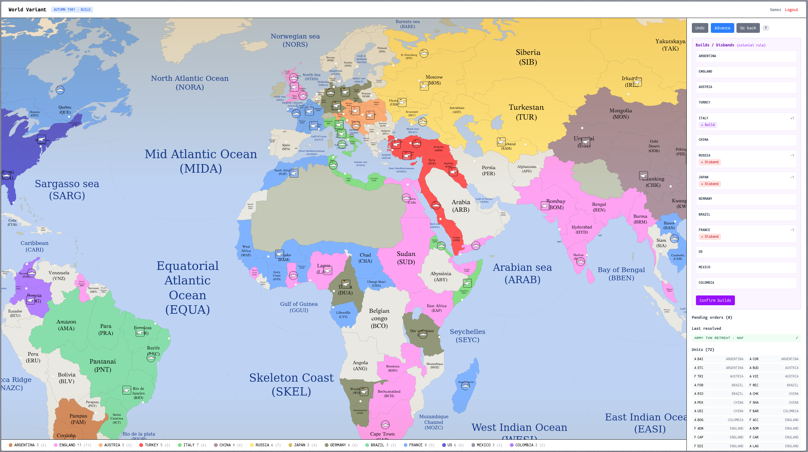

# UDiplomacy



Implementación del juego de mesa **Diplomacy** con variantes personalizadas,
regla colonial opcional y un mapa SVG interactivo con zoom y paneo.

## Stack

| Capa | Tecnología |
|------|-----------|
| Backend | Java 21, Spring Boot 4.0.6, Maven |
| Frontend | React 19, TypeScript 6, Vite 8, Tailwind CSS 4 |
| Base de datos | MongoDB 7 (estado de partida), PostgreSQL 16 (usuarios y proyecciones) |
| Autenticación | JWT (jjwt 0.12.6), BCrypt |
| Contenedores | Docker multi-stage, Docker Compose, Nginx |
| Tests | JUnit 5, Mockito, Testcontainers, Vitest, Testing Library |

## Arquitectura

**Hexagonal (Ports & Adapters)** con **DDD** y **CQRS**:

```
┌──────────────────────────────────────┐
│           Frontend React             │
│  (SPA servida por Nginx / Vite dev)  │
└──────────────┬───────────────────────┘
               │ /api/ (HTTP + JWT)
┌──────────────▼───────────────────────┐
│       Controladores (REST)           │
│  infrastructure/web/controllers/     │
└──────────────┬───────────────────────┘
┌──────────────▼───────────────────────┐
│   Capa de Aplicación (Use Cases)     │
│   application/port/input/            │
│   application/service/               │
└──────┬───────────────────┬───────────┘
       │                   │
       ▼                   ▼
┌──────────────┐   ┌──────────────┐
│   Dominio    │   │ Puertos de   │
│  (sin deps)  │   │  salida      │
│ domain/game/ │   │ port/output/ │
└──────────────┘   └──────┬───────┘
                          │
              ┌───────────┴───────────┐
              │                       │
              ▼                       ▼
┌──────────────────────┐  ┌──────────────────────┐
│   MongoDB (write)    │  │  PostgreSQL (read)    │
│  games, map_variants │  │  users, projections  │
└──────────────────────┘  └──────────────────────┘
```

### Principios

- **El dominio es puro Java** — sin anotaciones Spring, sin dependencias de framework
- **CQRS** — MongoDB almacena el agregado completo de partida (escritura); PostgreSQL
  mantiene proyecciones optimizadas para consultas (usuarios, listado de partidas)
- **Eventos de dominio** — `GameStarted`, `PhaseEnded`, `TurnEnded`, `GameFinished`
  se disparan y persisten; el adaptador de eventos actualiza la proyección PostgreSQL
- **JWT stateless** — sin sesión en servidor, el token se valida en cada request

## Inicio rápido

### Prerrequisitos

- Java 21, Maven, Node.js 22, MongoDB 7, PostgreSQL 16

### Backend

```bash
# Usando Maven wrapper
./mvnw spring-boot:run -Dspring-boot.run.profiles=local

# O empaquetar y ejecutar
./mvnw package -DskipTests
java -jar target/udiplomacy-*.jar --spring.profiles.active=local
```

### Frontend (desarrollo)

```bash
cd frontend
npm install
npm run dev      # Sirve en :5173 con proxy a backend :8080
```

### Docker (producción)

```bash
docker compose up --build
# Frontend: http://localhost
# Backend:  http://localhost:8080/api/
```

### Usuario admin por defecto

```
Usuario: admin
Clave:   diplomacy
```

El registro público siempre crea usuarios con rol `PLAYER`.

## API REST

### Autenticación (`/api/auth`)

| Método | Ruta | Descripción |
|--------|------|-------------|
| `POST` | `/api/auth/register` | Registrar usuario (body: `username`, `password`) |
| `POST` | `/api/auth/login` | Iniciar sesión (body: `username`, `password`) |

Ambos devuelven: `{ token, username, role }`.

### Partidas (`/api/games`)

| Método | Ruta | Descripción |
|--------|------|-------------|
| `GET` | `/api/games` | Listar partidas del usuario autenticado |
| `POST` | `/api/games` | Crear partida (body: `{ mapId }`) |
| `GET` | `/api/games/{id}` | Obtener estado completo de la partida |
| `POST` | `/api/games/{id}/orders` | Enviar orden (body: `{ rawOrder: "F LON - ENG" }`) |
| `DELETE` | `/api/games/{id}/orders/{index}` | Eliminar orden pendiente |
| `POST` | `/api/games/{id}/execute` | Ejecutar todas las órdenes pendientes |
| `POST` | `/api/games/{id}/retreats` | Resolver retiradas |
| `POST` | `/api/games/{id}/builds` | Resolver construcciones/desbandes |
| `GET` | `/api/games/{id}/retreat-options` | Opciones de retirada disponibles |
| `GET` | `/api/games/{id}/build-options` | Capacidades de construcción por nación |
| `POST` | `/api/games/{id}/undo` | Deshacer último turno |
| `POST` | `/api/games/{id}/advance` | Avanzar a siguiente fase |
| `POST` | `/api/games/{id}/rewind/{turn}` | Rebobinar a turno específico |
| `GET` | `/api/games/{id}/history` | Historial completo de la partida |
| `DELETE` | `/api/games/{id}` | Eliminar partida (solo propietario) |

### Mapas (`/api/maps`)

| Método | Ruta | Descripción |
|--------|------|-------------|
| `GET` | `/api/maps` | Listar variantes de mapa disponibles |
| `GET` | `/api/maps/{id}` | Detalle de variante (con SVG) |
| `GET` | `/api/maps/{id}/svg` | SVG del mapa (`Content-Type: image/svg+xml`) |
| `POST` | `/api/admin/maps` | Crear variante (multipart: `name`, `mapJson`, `svgContent`, `colonialRule`) |
| `DELETE` | `/api/admin/maps/{id}` | Eliminar variante (no se puede eliminar `europe-classic`) |

### Administración (`/api/admin`)

| Método | Ruta | Descripción |
|--------|------|-------------|
| `GET` | `/api/admin/users` | Listar usuarios |
| `PUT` | `/api/admin/users/{id}/role` | Cambiar rol (body: `{ role }`) |
| `DELETE` | `/api/admin/users/{id}` | Eliminar usuario |
| `GET` | `/api/admin/games` | Listar todas las partidas |
| `DELETE` | `/api/admin/games/{id}` | Eliminar cualquier partida |

### Órdenes (`/api/orders`)

| Método | Ruta | Descripción |
|--------|------|-------------|
| `GET` | `/api/orders/syntax` | Sintaxis de órdenes (documentación) |

## Formato de variante de mapa

Las variantes se definen en JSON con la siguiente estructura:

```json
{
  "id": "mi-variante",
  "name": "Mi Variante",
  "colonialRule": false,
  "provinces": [
    {
      "name": "LON",
      "type": "COASTAL",
      "homeNation": "ENGLAND",
      "supplyCenter": true,
      "coasts": null,
      "adjacencies": {
        "YOR": null,
        "WAL": null,
        "NTH": null,
        "ENG": null
      }
    }
  ],
  "initialUnits": [
    {
      "nation": "ENGLAND",
      "units": [
        { "nation": "ENGLAND", "unitType": "FLEET", "province": "LON" },
        { "nation": "ENGLAND", "unitType": "ARMY",  "province": "EDI" }
      ]
    }
  ]
}
```

### Adyacencias costeras

Ver `doc/python\ utils/coast_readme.md` para documentación detallada.

Resumen:
- `null` = adyacencia sin restricción de costa
- `"north"`, `"south"`, `"east"`, `"west"` = solo accesible por esa costa concreta
- Provincias con una sola costa: todo `null`
- Provincias con costas nombradas: ej. `"coasts": ["north", "south"]`
- La adyacencia es **bidireccional**: si A→B existe, B→A debe existir

### Formato del SVG

El SVG debe cumplir:
- Cada provincia como `<path>` con `id="provincia-CODE"` y `data-code="CODE"`
- Agrupadas por capas `SEA`, `COAST`, `INLAND` (para detectar tipo)
- `data-code` en cada path de provincia

Herramientas Python en `doc/python\ utils/` para preparar variantes:

| Script | Propósito |
|--------|-----------|
| `extract_ids.py` | Extraer provincias del SVG a CSV con tipos |
| `add_datacode.py` | Añadir `data-code` a paths del SVG |
| `prefix_ids.py` | Renombrar `id` a `provincia-CODE` |
| `csv_to_variant.py` | Convertir CSV completo a JSON de variante |
| `generate_variant.py` | Generar JSON básico desde SVG + adyacencias |

## Regla Colonial

Cuando está activada, los espacios de construcción no usados en una fase
de construcción de otoño se acumulan para la siguiente fase de construcción
del año siguiente, permitiendo construir en centros de suministro no
iniciales (coloniales) que estén bajo control.

Comportamiento:
- `unusedBuilds[nation] = buildsAllowed - homeBuildsExecuted`
- En la siguiente BUILD, esos espacios se suman a `colonialBuildsAvailable`
- Se consumen al usarse, no se acumulan entre años
- Las provincias coloniales disponibles son SCs controlados no iniciales
  y vacíos

## Tests

### Backend (JUnit 5 + Testcontainers)

```bash
./mvnw test
./mvnw verify     # Incluye JaCoCo (mínimo 60% cobertura)
```

18 archivos de test: dominio (Game, ConflictResolver, OrderParser),
servicios de aplicación (creación, registro, login, ejecución),
controladores REST.

### Frontend (Vitest)

```bash
cd frontend
npx vitest run
```

### Tests de compilación TypeScript

```bash
cd frontend
npx tsc --noEmit
```

## Estructura del proyecto

```
udiplomacy/
├── Dockerfile                      # Backend multi-stage
├── docker-compose.yml              # MongoDB + PostgreSQL + Backend + Frontend
├── pom.xml                         # Maven (Spring Boot 4.0.6, Java 21)
├── mvnw
│
├── src/main/java/com/ulises/udiplomacy/
│   ├── UDiplomacyApplication.java
│   ├── application/
│   │   ├── port/input/             # Interfaces de casos de uso
│   │   ├── port/output/            # Interfaces de repositorios
│   │   └── service/                # Implementaciones de casos de uso
│   ├── domain/
│   │   ├── game/                   # Agregado Game, Province, Unit, Order, Turn
│   │   ├── game/enums/             # ProvinceType, UnitType, Phase, Season, etc.
│   │   ├── game/events/            # Eventos de dominio
│   │   ├── game/services/          # ConflictResolver, OrderParser
│   │   └── user/                   # User, GameReference, Role
│   ├── infrastructure/
│   │   ├── config/                 # Beans, DataSeeder, SecurityConfig
│   │   ├── events/                 # Adaptador de eventos
│   │   ├── map/                    # MapLoader
│   │   ├── persistence/
│   │   │   ├── mongodb/            # Entidades y repositorios MongoDB
│   │   │   └── postgres/           # Entidades y repositorios PostgreSQL
│   │   └── web/
│   │       ├── config/             # Security config, JWT config
│   │       ├── controllers/        # Controladores REST
│   │       ├── dto/request/        # DTOs de entrada
│   │       ├── dto/response/       # DTOs de salida
│   │       └── security/           # JWT filter, token provider
│   └── shared/error/               # DomainException, GlobalExceptionHandler
│
├── frontend/
│   ├── Dockerfile                  # Frontend multi-stage (Node + Nginx)
│   ├── nginx.conf                  # Reverse proxy para producción
│   ├── vite.config.ts              # Vite + proxy dev
│   ├── src/
│   │   ├── main.tsx
│   │   ├── App.tsx                 # Router + guards de autenticación
│   │   ├── api/                    # Cliente Axios + endpoints
│   │   ├── hooks/useAuth.tsx        # Contexto de autenticación
│   │   ├── pages/                  # Login, Register, Games, GameDetail, Admin
│   │   ├── types/index.ts          # Interfaces TypeScript
│   │   └── utils/map.ts            # Utilidades SVG (centros, unidades, colores)
│   └── public/assets/units/        # Iconos army.svg, fleet.svg
│
├── doc/
│   ├── python utils/               # Scripts para generación de variantes
│   │   ├── README.md
│   │   ├── coast_readme.md         # Documentación de adyacencias costeras
│   │   ├── csv_to_variant.py
│   │   ├── extract_ids.py
│   │   ├── add_datacode.py
│   │   ├── prefix_ids.py
│   │   └── generate_variant.py
│   └── world_one_variant/          # Ejemplo de variante mundial
└── doc/python utils/coast_readme.md
```

## Variables de entorno

| Variable | Descripción | Valor por defecto |
|----------|-------------|-------------------|
| `SPRING_MONGODB_URI` | URI de MongoDB | `mongodb://mongodb:27017/udiplomacy` |
| `SPRING_DATASOURCE_URL` | JDBC URL de PostgreSQL | `jdbc:postgresql://postgres:5432/udiplomacy` |
| `SPRING_DATASOURCE_USERNAME` | Usuario PostgreSQL | `postgres` |
| `SPRING_DATASOURCE_PASSWORD` | Contraseña PostgreSQL | `postgres` |
| `APP_JWT_SECRET` | Clave HMAC-SHA para JWT (Base64) | `c2VjcmV0...` |

## Rutas del frontend

| Ruta | Acceso | Descripción |
|------|--------|-------------|
| `/login` | Público | Inicio de sesión |
| `/register` | Público | Registro de usuario |
| `/games` | Autenticado | Lista de partidas + crear |
| `/games/:id` | Autenticado | Tablero de juego |
| `/admin/users` | Admin | Gestión de usuarios |
| `/admin/games` | Admin | Gestión de partidas |
| `/admin/maps` | Admin | Gestión de variantes de mapa |

## Review y observaciones para v1.0

### Fortalezas

- **Arquitectura hexagonal limpia**: dominio sin dependencias de framework,
  separación clara de capas, puertos y adaptadores bien definidos
- **Modelo de dominio rico**: `Game` encapsula invariantes (transiciones de estado,
  detección de victoria, validación de construcciones, auto-fill de holds)
- **CQRS efectivo**: MongoDB para escritura del agregado, PostgreSQL para
  consultas optimizadas
- **Soporte de variantes**: sistema completo de variantes con JSON, SVG,
  regla colonial y herramientas Python
- **Adyacencias costeras**: implementación correcta con soporte de costas
  múltiples y `shareSeaNeighbor()`
- **Cobertura de tests**: 18 tests backend incluyendo simulación de partida
  completa, resolución de conflictos, parser de órdenes
- **Contenerización**: builds multi-stage con health checks

### Áreas de mejora

| Área | Problema | Recomendación |
|------|----------|---------------|
| **Frontend** | `GameDetail.tsx` tiene 798 líneas | Dividir en componentes (MapView, OrderPanel, Sidebar, BuildPanel) |
| **Frontend** | Sin componentes compartidos | Extraer Navbar, Loading, ConfirmDialog, Toast |
| **Frontend** | 1 solo test | Añadir tests de páginas principales (Login, Games, Admin) |
| **Frontend** | Sin spinners/loading states | Añadir indicadores de carga en operaciones asíncronas |
| **Frontend** | Sin confirmaciones | Añadir diálogos de confirmación para borrar partidas/usuarios |
| **Backend** | JWT secret en properties | Mover a variable de entorno (`APP_JWT_SECRET`) |
| **Backend** | Context load test deshabilitado | Arreglar y habilitar `@Disabled` |
| **Backend** | Sin rate limiting | Añadir protección contra fuerza bruta en `/api/auth/` |
| **Infra** | Sin CI/CD | Añadir GitHub Actions (build, test, lint) |
| **Infra** | Sin Swagger/OpenAPI | Documentar endpoints con springdoc-openapi |
| **Infra** | Sin HTTPS | Configurar TLS en Nginx para producción |
| **Infra** | Sin health endpoint | Añadir `/api/health` con estado de bases de datos |

## Licencia

Licencia Apache 2.0 Ulises Lafuente Ramos 2026.
